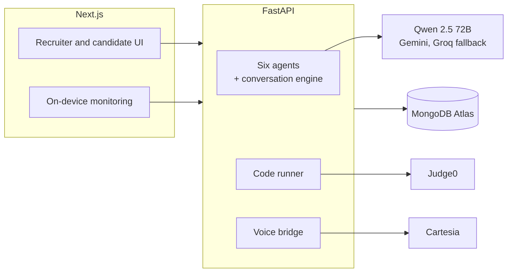

# BNB Interviews

**An AI technical interviewer for recruiters.**

Publish a job, share one link, and read a written report on every candidate.

**Live demo → [build-n-pray.vercel.app](https://build-n-pray.vercel.app)**  
API → [build-n-pray.onrender.com](https://build-n-pray.onrender.com)

## Overview

The recruiter publishes a job description and what to focus on. Each candidate who opens the link gets an interview built from that job and their own résumé:

1. **Coding round.** A timed DSA problem the agent wrote for this job, solved in a real editor.
2. **Project round.** A spoken conversation about the projects on their résumé.
3. **Fundamentals round.** A spoken conversation about the core concepts the job relies on.

The recruiter gets a ranked scoreboard and a report per candidate. Candidates never see their scores.

## Features

### The agents

BNB runs the interview with six specialised agents. Each has its own prompt and a strict JSON schema, and each reply is validated before anything reaches the candidate.

| Agent              | What it does                                                                                                                                                                                     |
| ------------------ | ------------------------------------------------------------------------------------------------------------------------------------------------------------------------------------------------ |
| **Profiler**       | Reads the job, the recruiter's focus and the résumé into a private brief: key requirements, résumé highlights, and the gaps worth probing                                                        |
| **Problem Author** | Writes an original DSA problem for the role, then runs its own reference solution in a sandbox to produce the expected outputs, so every test case is verified. The reference is then discarded. |
| **Planner**        | Picks the skills each spoken round needs evidence on, drawing on the job and on what this candidate claims to have built                                                                         |
| **Interviewer**    | After every answer: rates it privately, notes claims worth checking, updates its read on the skill, and chooses the next move                                                                    |
| **Code Reviewer**  | Reads the submission against the sandbox results and judges its real time and space complexity against the target                                                                                |
| **Reporter**       | Turns the whole session into a recruiter-facing report, with evidence for every rating and follow-up questions aimed at what the interview couldn't confirm                                      |

The Interviewer's moves:

| Move                                      | Example                                                 |
| ----------------------------------------- | ------------------------------------------------------- |
| Follow up on a vague answer or a claim    | "How did you measure that speed-up?"                    |
| Pick up something relevant they mentioned | "You mentioned Java. How comfortable are you with OOP?" |
| Move to the next skill                    | When it has enough evidence either way                  |
| Wrap up                                   | When the round's turn budget is spent                   |

A conversation engine keeps the Interviewer on track. Each round has a turn budget, with caps on follow-ups per topic and on chasing mentions. The engine aggregates skills covered across all rounds to ensure no redundant questions are asked. Allowed moves are recomputed on every turn. If the model picks a move outside the budget, it gets one targeted correction. If it strays again, the engine bends the move back within limits.

To reduce latency, the conversation uses hardcoded openers and dynamically shrinks its context window by relying on an initial summary rather than the full resume on every turn. Candidates also have an option to abort the interview early from the dashboard or the voice screen.

### Voice, powered by [Cartesia](https://cartesia.ai)

- **Sonic 3.5** speaks each question aloud. The text stays on screen.
- **Ink 2** transcribes the spoken answer live. The candidate can edit the transcript before submitting.
- All Cartesia calls go through the API, so the key never reaches the browser. If Cartesia is unavailable, the browser's own voice takes over.

### Coding round

- Monaco editor in 13 languages. Starter code already parses the input.
- Code runs in a Judge0 sandbox against hidden tests. The agent reviews complexity against the target.
- The timer is kept on the server, and drafts are saved. When time runs out, the current code is submitted.

### Recruiter report

Written in the third person, never as coaching. For example:

> **What they didn't show.** Did not say how they measured latency. A strong answer would give before and after numbers.

Each report includes round scores, per-skill ratings with evidence, notes on communication, the submitted code, and questions for a follow-up interview.

### Monitoring

Runs in the candidate's browser with MediaPipe and TensorFlow.js, and no video is uploaded. It records a missing face, extra people, a phone, gaze held off the screen, tab switches and full-screen exits (even while models are loading). The recruiter sees these as observations to review, not verdicts. Right-click is disabled globally, and copy/paste is blocked during the spoken rounds.

## Under the hood

**Self-healing model layer.** The agents run on Qwen 2.5 72B through Hugging Face, with Gemini and Groq behind it. A provider that fails is benched for five minutes, or for as long as its rate limit says, so the next call goes straight to a healthy one. If every provider is rate-limited briefly, the layer waits and retries instead of failing. A malformed reply gets a stricter second request, and fenced or half-wrapped JSON is recovered before validation.

**Verified problem authoring.** A problem only ships if its tests hold up. The author's reference solution runs on every case. Cases it crashes on are dropped, and the problem is kept only if at least two visible and two hidden cases survive. Double-escaped newlines, a common model error, are repaired before anything runs.

**Streaming voice pipeline.** The browser streams 16 kHz PCM over a WebSocket to the API, which relays it to Cartesia Ink 2. Ink's turn events are folded into one running transcript, so a pause mid-thought never ends the answer. Spoken questions are synthesised server-side with Sonic 3.5 and cached per question.

**On-device vision.** Gaze is computed from MediaPipe iris landmarks and eye-look blendshapes. A downward glance at the keyboard gets a five-second grace period, while looking sideways or up is timed at once. COCO-SSD detects phones and extra people. The server counts each condition once per episode, so a camera polling every two seconds can't burn through the warning limit. In Chromium, the Keyboard Lock API holds Escape so a single press can't drop the candidate out of full screen.

**Sandboxed judging.** Each submission runs as one Judge0 batch across every test. CPU limits include an allowance for interpreter start-up, so a busy public instance can't fail correct code at random. Output is compared line by line with trailing whitespace ignored, and hidden inputs never leave the server.

**Access control built in.** Every session endpoint checks who is calling. Candidates can only reach their own attempt, and only the recruiter who published an interview can read its reports. Scores, agent notes and the recruiter's brief are removed from every response a candidate receives.

## Scoring

| Score        | Calculation                                                                        |
| ------------ | ---------------------------------------------------------------------------------- |
| Coding       | Up to 85 for tests passed, plus 15 if all pass and the complexity meets the target |
| Spoken round | Average of the per-skill ratings                                                   |
| Overall      | Average of the completed rounds                                                    |

## Architecture



| Layer          | Technology                                                      |
| -------------- | --------------------------------------------------------------- |
| Frontend       | Next.js 16, React, Tailwind CSS 4, Monaco                       |
| Backend        | FastAPI, Python 3.13, LangGraph                                 |
| Models         | Qwen 2.5 72B on Hugging Face, with Gemini and Groq as fallbacks |
| Voice          | Cartesia Sonic 3.5 and Ink 2                                    |
| Code execution | Judge0                                                          |
| Monitoring     | MediaPipe Face Landmarker, TensorFlow.js COCO-SSD               |
| Database       | MongoDB Atlas                                                   |
| Hosting        | Render (API) · Vercel (frontend)                                |

## Getting started

```powershell
# API, from Build-N-Pray/
uv sync
copy .env.example .env
uv run main.py

# Frontend, from Build-N-Pray/frontend/
npm install
npm run dev
```

Open `http://localhost:3000`. To try it:

1. Create an interviewer account with `ADMIN_ACCESS_CODE`.
2. Publish a job.
3. Take the link as a candidate in a private window.

### Environment

| Variable                         | Purpose                                    |
| -------------------------------- | ------------------------------------------ |
| `HUGGINGFACE_API_KEY`            | Interview agent (required)                 |
| `GEMINI_API_KEY`, `GROQ_API_KEY` | Fallback providers                         |
| `CARTESIA_API_KEY`               | Spoken questions and answers               |
| `MONGODB_URI`                    | Database. If empty, data is kept in memory |
| `ADMIN_ACCESS_CODE`              | Required to create an interviewer account  |
| `CODE_RUNNER`                    | `judge0` (default) or `local`              |

### Tests

```powershell
uv run --with pytest pytest
```
